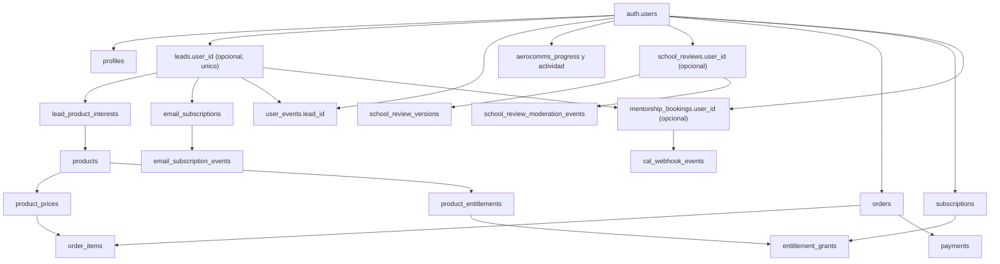

# Auditoria profunda: Warhome y CRM actual

**Fecha:** 2026-07-29

**Alcance:** fotografia del repositorio actual. No incluye cambios de codigo, migraciones, configuracion remota ni diseno de una arquitectura futura.
**Punto de partida:** [crm-audit-report.md](/Users/jorgefeliublasco/Documents/flypath-career-planner/docs/audits/crm-audit-report.md).

## Resumen ejecutivo

FlyPath ya dispone de piezas CRM y comerciales relevantes: identidad con Supabase Auth, perfiles, leads con intereses, consentimiento por lista, trabajos y entregas de email, eventos, catalogo de productos, pedidos, pagos, suscripciones, entitlements, actividad AeroComms, opiniones y reservas de mentorias. Estas piezas no forman aun un CRM unificado.

Warhome es un Command Center privado protegido para administradores activos. Hoy permite consultar directorios de leads, usuarios y emails, y moderar opiniones. La visibilidad operativa de usuarios AeroComms es particularmente completa y no depende de que exista un lead. Sin embargo, no existen vistas Warhome de compras, suscripciones, entitlements, reservas, notas, campañas, segmentos, tareas ni una ficha 360 que conecte todas las relaciones de una persona.

La conclusion es que la base de datos contiene suficiente material para comenzar una fase CRM, pero la capa operativa sigue fragmentada: los datos estan separados deliberadamente por dominio y Warhome solo los conecta de forma puntual.

## 1. Mapa actual de Warhome

### Acceso y superficie disponible

Todas las rutas bajo `/warhome/(protected)` se protegen con `getWarhomeAuthorization()`: valida la sesion con Supabase Auth y exige un registro activo en `admin_users` con rol `admin` u `owner`. Las consultas usan un cliente server-side con privilegios administrativos; no se expone un cliente de datos de Warhome al navegador.

| Modulo | Ruta | Que hace hoy | Datos principales | Acciones disponibles | Estado |
| --- | --- | --- | --- | --- | --- |
| Resumen | `/warhome` | Pantalla de entrada con accesos rapidos. | Ningun agregado operativo central. | Navegacion. | Parcial |
| Leads | `/warhome/leads` | Directorio paginado, busqueda y filtros de leads. Muestra fuente, etapa, estado, interes y estado agregado de marketing. | `leads`, `lead_product_interests`, `products`, `email_subscriptions`. | Abrir detalle. | Parcial |
| Detalle de lead | `/warhome/leads/[leadId]` | Consulta identidad del lead, intereses, consentimiento y actividad atribuida a lead. | `leads`, intereses, suscripciones y eventos de email/actividad. | Solo navegacion. | Parcial |
| Usuarios | `/warhome/users` | Directorio de todas las cuentas, incluso sin lead, con filtros de cuenta, perfil, AeroComms, marketing y lead. | `auth.users` mediante RPC cerrada, `profiles`, progreso AeroComms, `leads`, `email_subscriptions`. | Abrir detalle. | Completo para consulta basica |
| Detalle de usuario | `/warhome/users/[userId]` | Vista de cuenta, perfil, resumen y sesiones AeroComms, lead opcional y marketing. | Auth, `profiles`, tablas AeroComms, `leads`, suscripciones. | Enlace al lead si existe. Compras son un placeholder explicito. | Parcial |
| Emails | `/warhome/emails` | Directorio de trabajos, entregas y actividad de email con filtros y metricas basicas. | `email_jobs`, `email_deliveries`, `leads`. | Consulta y filtros. | Parcial |
| Opiniones | `/warhome/reviews` | Cola de moderacion con busqueda y filtro de estado. | `school_reviews`, `schools`, `profiles`. | Abrir detalle. | Completo para listado/moderacion |
| Detalle de opinion | `/warhome/reviews/[reviewId]` | Muestra texto, puntuaciones, relacion con escuela, estado, versiones e historial de moderacion. | `school_reviews`, `school_review_versions`, `school_review_moderation_events`, `schools`, `profiles`. | Aprobar, rechazar, ocultar, restaurar a pendiente o eliminar segun transicion permitida. | Completo para moderacion |

La navegacion tambien declara Notas, Ajustes, Analytics, Productos, Contenido, Campanas, Agentes y Tareas, pero no tienen ruta activa. Son marcadores de futura capacidad, no modulos funcionales.

### Detalle funcional por modulo

**Leads.** El directorio trabaja con paginacion de 20, total exacto, busqueda por nombre o email y filtros de fuente, etapa del funnel y estado. La ficha agrega intereses de producto, suscripciones y eventos asociados a `lead_id`. La metadata de eventos se reduce a claves permitidas para no mostrar datos sensibles. No permite editar etapa o estado, asignar responsable, anadir notas, fusionar duplicados, enviar emails ni ver pedidos, reservas o actividad de una cuenta relacionada.

**Usuarios.** La lista procede de la RPC `get_warhome_user_directory`, creada para leer una proyeccion limitada de Auth solo desde servidor. Incluye email confirmado, alta y ultimo acceso, nombre o perfil incompleto, estado AeroComms, sesiones, racha, importacion y reset, ejercicios/misiones completados, lead opcional y estado de marketing. El detalle conserva este limite y muestra hasta 20 sesiones recientes. Es la unica vista que aproxima una ficha de usuario operativo, pero no incorpora comercio, entitlements, comunicaciones, opiniones o reservas.

**Emails.** Muestra trabajos pendientes, procesados, enviados, fallidos o cancelados, junto con entregas, proveedor, reintentos y algunas senales de engagement. Es una consola de observacion: no hay composicion, reenvio manual, cancelacion, inscripcion a secuencias ni segmentacion desde Warhome.

**Opiniones.** Es el modulo mas accionable. La moderacion usa la RPC atomica `moderate_school_review_atomically`, valida transiciones y añade un evento append-only. Sus transiciones actuales son `pending -> approved/rejected`, `approved -> hidden`, `hidden/rejected -> pending` y `deletion_requested -> deleted`. Esta capacidad es especifica de opiniones; no convierte Warhome en un CRM de proposito general.

## 2. Mapa de entidades y relaciones reales

| Entidad | Tabla o fuente canonica | Relaciones existentes | Observaciones de duplicidad o separacion |
| --- | --- | --- | --- |
| Cuenta | `auth.users` | `profiles` 1:0..1; lead opcional unico; comercio y actividad por `user_id`. | Es la identidad de autenticacion. No equivale a lead ni a consentimiento. |
| Perfil | `profiles` | PK/FK `user_id` contra Auth. | Incluye datos de cuenta/preferencias y un campo historico de marketing; el consentimiento operativo debe leerse de listas y eventos. |
| Lead | `leads` | `user_id` opcional unico; intereses, listas, eventos y trabajos de email. | Un lead puede no tener cuenta. La vinculacion por email confirmado durante bootstrap es controlada; no se crean leads por crear cuenta. |
| Interes comercial | `lead_product_interests` | Unico por `lead_id + product_id`. | Modela interes, no compra ni entitlement. |
| Consentimiento | `email_subscriptions` y `email_subscription_events` | Pertenece al lead y a una lista. | Conviven campos historicos de consentimiento en `leads`/`profiles`; no deben competir con la fuente por lista. |
| Trabajo/entrega de email | `email_jobs`, `email_deliveries`, webhooks de proveedor | Puede referenciar lead o review segun plantilla. | Registra operacion transaccional/marketing, no un historial CRM unificado por persona. |
| Evento | `user_events` | `user_id`, `lead_id` y `product_id` son opcionales. | Tiene eventos de conversion asociados a lead y analitica web generica. Esta ultima no resuelve de forma general una identidad Auth. |
| Producto/catalogo | `products`, `product_prices`, `stripe_catalog_bindings`, `product_entitlements` | Pedidos, lineas, suscripciones y grants. | El catalogo es privado/server-side. Interes de lead y compra son relaciones separadas correctamente. |
| Compra/pago | `orders`, `order_items`, `payments`, `checkout_attempts` | Usuario opcional en compras invitadas; Stripe y entrega segura. | No hay vinculacion automatica de una compra invitada a una cuenta por coincidencia de email. |
| Acceso | `entitlements`, `entitlement_grants`, `subscriptions` | Grants proceden de producto o suscripcion. | Fuente de verdad para acceso, separada de pago y de progreso. |
| Actividad AeroComms | `aerocomms_progress`, sesiones y progreso de ejercicios/misiones | Por `user_id`. | No crea lead ni modifica marketing. Warhome ya lo muestra, pero fuera de la ficha comercial. |
| Opinion | `school_reviews`, versiones y eventos de moderacion | Cuenta opcional, escuela obligatoria. | Tiene email de autor/verificacion propio. No crea lead, cuenta, compra o suscripcion. |
| Reserva de mentoria | `mentorship_bookings`, `cal_webhook_events` | `user_id` y `lead_id` opcionales. | La proyeccion de Cal.com no enlaza automaticamente por email; evita asociacion especulativa, pero queda aislada de Warhome. |
| Nota interna | `admin_notes` | Infraestructura existente. | No se ha encontrado superficie Warhome activa que la consuma. |

## 3. Flujos reales de usuario

### Caso 1: visitante -> lead -> usuario

| Paso | Comportamiento actual | Persistencia y conexiones | Que falta |
| --- | --- | --- | --- |
| Visita y navega | La analitica web puede guardar eventos limitados con sesion/anonimo, pagina y UTM. | `user_events` mediante el endpoint de tracking; no hay resolucion universal de persona. | Unir de forma consentida una sesion anonima a una identidad posterior. |
| Completa un formulario de captacion | Newsletter, informe gratuito, Pre-PPL y mentoria crean o actualizan un lead segun el flujo. | `leads`, interes de producto cuando corresponde, conversiones y trabajos de email. | Una linea temporal transversal que agrupe todos los formularios y respuestas. |
| Acepta marketing cuando procede | Newsletter e informe gratuito usan doble opt-in. Otros formularios no infieren consentimiento. | Listas, eventos y tokens de confirmacion. | Consulta CRM central de consentimiento por contacto. |
| Crea o confirma una cuenta | OTP crea/recupera Auth y bootstrap crea el perfil. | `auth.users`, `profiles`. | No se crea lead de forma automatica, por decision de producto. |
| Se vincula con lead existente | Solo tras email confirmado, bootstrap puede asignar a la cuenta un lead sin `user_id` con el mismo email. | `leads.user_id`. | Warhome no muestra todavia una cronologia fusionada cuenta/lead ni ofrece gestion de conflictos. |

### Caso 2: lead -> producto -> compra -> acceso

| Paso | Comportamiento actual | Persistencia y conexiones | Que falta |
| --- | --- | --- | --- |
| Muestra interes | Formularios concretos escriben `lead_product_interests`. | Lead + producto. | Segmentacion y seguimiento comercial desde Warhome. |
| Inicia checkout | El checkout resuelve producto y precio en servidor. Career Planner y guia admiten invitado; AeroComms Pro exige cuenta. | `checkout_attempts`, `orders`, `order_items`. | Vista comercial en Warhome y seguimiento de abandono. |
| Pago confirmado | El webhook firmado de Stripe es la fuente de verdad. | `payments`, estado del pedido y eventos Stripe. | Lectura unificada por lead/usuario y operativa de incidencias. |
| Entrega/acceso | Descargas usan token opaco por entrega; AeroComms Pro usa grants de entitlement desde suscripcion. | Tokens de entrega o `entitlement_grants`. | Relacion voluntaria entre compra invitada y cuenta posterior; no se hace por email automaticamente. |

La separacion evita atribuciones incorrectas, pero una persona que fue lead y compra como invitada puede aparecer en registros separados hasta que exista una regla de reclamacion explicita.

### Caso 3: usuario -> actividad -> emails -> conversion

| Paso | Comportamiento actual | Persistencia y conexiones | Que falta |
| --- | --- | --- | --- |
| Usa AeroComms | Se guardan progreso, sesiones, puntuacion, racha, importacion/reset y actividad. | Tablas AeroComms por `user_id`. | Esta actividad no alimenta por si misma un lead, marketing ni un funnel, por decision correcta. |
| Warhome consulta actividad | Directorio y detalle de usuarios agregan progreso y sesiones recientes. | RPC del directorio y consultas server-only acotadas. | Enlazar con compra, entitlement, email y conversion sin mezclar las fuentes de verdad. |
| Recibe email | Emails transaccionales se encolan/registran para casos concretos; marketing solo con consentimiento real. | Jobs, entregas y suscripciones. | Secuencias de lifecycle basadas en eventos; no se encontro scheduler/worker de `email_sequences`. |
| Convierte | Un checkout y su webhook escriben datos de comercio. | Pedidos, pagos, suscripciones o grants. | Atribucion fiable desde actividad/contenido hasta compra. |

### Caso 4: contenido externo (TikTok, Instagram o YouTube) -> FlyPath

| Paso | Comportamiento actual | Persistencia y conexiones | Que falta |
| --- | --- | --- | --- |
| Entra desde contenido externo | Puede llegar con UTM o por una URL sin campana. | Tracking generico conserva UTM y contexto limitado cuando se usa el endpoint. | Modelo de campanas, enlace de contenido y atribucion consistente. |
| Navega o pulsa CTA | Se registran algunos eventos permitidos de pagina, CTA, popup y formulario. | `user_events` de analitica web. | Asociar eventos anonimos con lead/usuario de forma segura tras conversion. |
| Deja datos | Los formularios guardan `latest_source`/contexto segun flujo y pueden registrar conversion. | Leads, intereses, eventos. | Estandarizacion de origen y una vista para comparar TikTok, Instagram, YouTube, Google y recomendacion. |
| Compra | Commerce registra la compra sin usar el origen como autorizacion. | Comercio separado. | Atribucion entre origen y venta, especialmente en compras invitadas. |

## 4. CRM actual por dominio

### Leads

- **Creacion y actualizacion:** existen servicios server-side de captura; el email es unico en `leads` y los intereses se deduplican por producto.
- **Fuentes y estados:** se guardan fuente inicial/ultima, etapa del funnel y estado. Warhome los consulta, no los modifica.
- **Consentimiento:** no se infiere por formularios de soporte, mentoria, uso de producto, cuenta, compra u opinion. El doble opt-in se limita a los flujos que lo piden.
- **Limite actual:** el lead no tiene hoy una ficha 360 operativa con compras, reservas, cuenta, emails y notas.

### Usuarios

- **Identidad:** Auth es la fuente de verdad; `profiles` es una extension 1:1 tolerante a ausencia.
- **Informacion disponible:** nombre, preferencias, autenticacion, confirmacion de email, actividad AeroComms, lead opcional y marketing a traves del lead.
- **Estado operativo:** Warhome ya cubre mejor este dominio que el resto, sin exponer metadata, proveedores, tokens ni sesiones.
- **Limite actual:** no muestra productos adquiridos, pagos, suscripciones, grants, opiniones o reservas.

### Emails

- **Proveedor:** Resend para envio y eventos de entrega; Stripe, Cal.com y Supabase son fuentes externas de otros dominios, no sustitutos del sistema de email.
- **Triggers existentes:** confirmaciones de newsletter/Planner, Pre-PPL, solicitudes de mentoria, alertas internas, verificacion de opiniones y comunicaciones de compra/entrega cuando aplica.
- **Consentimiento:** listas y eventos son la fuente de verdad; hay unsubscribe, bounced, complained y blocked.
- **Limite actual:** no hay gestor de campanas ni secuencias operativas en Warhome; las tablas de secuencias no tienen un ejecutor identificado en el codigo revisado.

### Productos, compras y accesos

- **Catalogo:** productos, precios, bindings Stripe por entorno y mapeos a entitlements existen y se resuelven en servidor.
- **Compras:** pedidos, lineas, intentos, pagos y eventos Stripe son idempotentes y separados de los leads.
- **Acceso:** descargas y AeroComms Pro no comparten la misma semantica: las primeras usan entrega protegida y Pro usa `entitlement_grants` derivados de suscripcion.
- **Limite actual:** Warhome no tiene modulo ni ficha de comercio.

### Eventos y tracking

- **Medible hoy:** navegacion basica, UTM/contexto cuando llega, conversiones de formularios, algunos CTA, actividad AeroComms, eventos de entrega/email y eventos de proveedores.
- **No medible de extremo a extremo:** atribucion fiable contenido externo -> contacto -> compra -> acceso, ni lifecycle comercial agregado por persona.
- **Principio actual valido:** no convertir telemetria de producto en lead ni consentimiento por inferencia.

## 5. Automatizaciones actuales

| Automatizacion | Estado | Evidencia funcional actual |
| --- | --- | --- |
| Doble opt-in de newsletter e informe gratuito | ✅ Funciona | Token, confirmacion y estados de lista separados. |
| Confirmacion transaccional de Pre-PPL | ✅ Funciona | Job/entrega transaccional tras captura. |
| Solicitud de mentoria y alerta interna | ✅ Funciona | Captura de lead y emails de confirmacion/aviso. |
| Verificacion de opinion de escuela | ✅ Funciona | Opinion, token, job y transicion de estado. |
| Confirmacion de pago/entrega digital | ✅ Funciona | Webhook Stripe, ledger y entrega protegida segun producto. |
| Sincronizacion de reserva Cal.com | ✅ Funciona | Webhook firmado e idempotente hacia proyeccion operativa. |
| Baja, rebote, queja y bloqueo de marketing | ✅ Funciona | Estados por lista y eventos del proveedor. |
| Secuencias comerciales o lifecycle | ⚠️ Parcial | Esquema de secuencias/steps/enrollments presente; no se localizo un scheduler o worker que las ejecute. |
| Campanas y segmentacion desde Warhome | ❌ No existe | Navegacion futura sin modulo activo. |
| Automatizacion basada en actividad AeroComms | ❌ No existe | Progreso se guarda, pero no dispara CRM/marketing. |
| Atribucion automatica de contenido a ventas | ❌ No existe | Solo UTM/contexto y fuentes parciales. |

## 6. Warhome como Command Center

| Necesidad operativa | Estado actual | Evidencia |
| --- | --- | --- |
| Ver una lista de leads | ✅ | Directorio, filtros, interes y estado de marketing. |
| Ver una lista de usuarios con actividad | ✅ | Directorio de cuentas y detalle AeroComms sin requerir lead. |
| Ver el historial de actividad de un lead | ⚠️ | Solo `user_events` asociados a `lead_id`; no incluye cuenta/AeroComms/compras. |
| Ver el historial de una cuenta | ⚠️ | Perfil y sesiones AeroComms; falta comercio, email, opiniones, reservas y eventos generales. |
| Ver compras, pagos, suscripciones o grants | ❌ | Datos existen, pero el detalle de usuario declara compras `not_available`. |
| Ver reservas de mentoria | ❌ | Proyeccion Cal.com existe fuera de Warhome. |
| Ver comunicaciones de una persona | ⚠️ | Directorio global de emails y listas del lead, sin timeline unificada por contacto. |
| Gestionar consentimiento | ⚠️ | Se puede consultar; no se opera desde Warhome. |
| Tomar notas, asignar responsable o crear tareas | ❌ | `admin_notes` no tiene superficie activa; Notas/Tareas son navegacion futura. |
| Moderar opiniones | ✅ | Transicion atomica, motivo y nota interna. |
| Editar funnel, estado, intereses o relaciones | ❌ | Warhome es de lectura para leads/usuarios/emails. |
| Ver metricas ejecutivas consolidadas | ❌ | La pagina de resumen es estatica; Analytics es futura. |

## 7. Casos de uso que faltan

| Pregunta o accion | Posible hoy | Motivo |
| --- | --- | --- |
| Quien compro despues de venir de TikTok | No de forma fiable | Origen/UTM y compra no estan unidos en una consulta operativa ni siempre comparten identidad. |
| Ver todo el historial de un usuario | Parcial | Warhome muestra cuenta y AeroComms; no comercio, emails, opiniones, reservas ni timeline. |
| Ver todo el historial de un lead | Parcial | Muestra intereses, suscripciones y eventos de lead, no cuenta/compra/reserva relacionada. |
| Lanzar una campana a interesados en un producto | No | Intereses y consentimiento existen, pero faltan segmentos, composer y ejecucion. |
| Saber que contenido genera ventas | No | No existe entidad/atribucion de contenido a contacto y venta. |
| Resolver un duplicado lead/cuenta/compra invitada | No desde Warhome | Hay reglas de vinculacion prudentes, pero no herramienta de revision o fusion. |
| Ver clientes Pro con estado de cobro | No | Suscripciones y grants existen, pero Warhome no los presenta. |
| Revisar una reserva de mentoria y su pago Cal.com | No | La proyeccion existe sin modulo Warhome. |
| Moderar una opinion y conservar auditoria | Si | Es el caso de uso operativo cerrado actualmente. |

## 8. Gaps reales

### Ya existe

- Identidad y perfiles separados de leads, consentimiento y actividad.
- Captacion de leads con varias fuentes y deduplicacion por email.
- Intereses por producto, consentimiento por lista y eventos de subscription.
- Infraestructura comercial completa para pedidos, pagos, suscripciones y entitlements.
- Proyeccion de reservas de Cal.com y moderacion de opiniones con auditoria.
- Warhome protegido con roles activos y vistas server-only de leads, usuarios, emails y opiniones.
- Directorio de usuarios que no depende de tener lead, con actividad AeroComms agregada.

### Existe pero desconectado

- `leads.user_id` enlaza algunas cuentas verificadas, pero Warhome no resuelve una historia conjunta.
- Eventos web y conversiones conservan contexto, pero no dan atribucion completa hasta venta.
- Comercio, suscripciones y grants tienen datos maduros, pero no aparecen en Warhome.
- `mentorship_bookings` y Cal.com se sincronizan, pero no tienen vista interna.
- Trabajo/entrega de email se ve globalmente, pero no como actividad de un contacto.
- Tablas de secuencias existen sin ejecutor de automatizacion identificado.
- `admin_notes` existe sin experiencia operativa activa.

### Falta completamente

- Ficha CRM 360 de contacto o persona, con relaciones explicitadas y cronologia segura.
- Segmentacion, campanas, composer, reenvio y gestion de lifecycle desde Warhome.
- Edicion controlada de estados, etapas, notas, tareas y ownership comercial.
- Vistas de comercio, suscripciones, entitlements y soporte de pagos.
- Vistas de reservas de mentoria y seguimiento operacional.
- Atribucion de contenido/campana a lead, compra y venta.
- Metricas ejecutivas centralizadas y acciones sugeridas.

## 9. Recomendaciones de alto nivel

1. Mantener la separacion actual de fuentes de verdad. Auth, leads, consentimiento, producto, pago, entitlement, actividad, opinion y reserva no deben fusionarse semantica ni automaticamente por coincidencia de email.
2. Antes de ampliar Warhome, inventariar las relaciones que ya existen y decidir que enlaces pueden mostrarse con certeza, dejando visibles los casos no vinculados en vez de inferirlos.
3. Priorizar una consulta operativa transversal antes que acciones masivas: una ficha de contacto puede reunir referencias existentes sin redefinir los modelos de cada dominio.
4. Definir el ciclo de vida de cada automatizacion antes de activar secuencias: evento de entrada, consentimiento requerido, condiciones de salida, responsable y trazabilidad.
5. Estandarizar fuentes, origen declarado y UTMs en la captura futura para que una atribucion posterior sea posible sin reescribir historico ni afectar consentimiento.
6. Tratar comercio y mentorias como dominios operativos de primera clase en Warhome, manteniendo Stripe y Cal.com como fuentes externas de verdad.
7. Dejar Content OS como consumidor futuro de datos agregados y atribucion aprobada; no mezclarlo con el modelo CRM durante esta auditoria.

## Limites de esta auditoria

- Se ha revisado el codigo, contratos, migraciones y documentacion presentes en el repositorio. No se han inspeccionado registros reales ni se han ejecutado consultas modificadoras contra Supabase.
- El estado descrito como disponible se refiere a implementacion versionada; no afirma volumen, calidad o completitud de datos historicos en produccion.
- Las recomendaciones son de producto/operacion de alto nivel. No constituyen un diseno de tablas, migraciones ni una propuesta cerrada de arquitectura para la siguiente fase.
